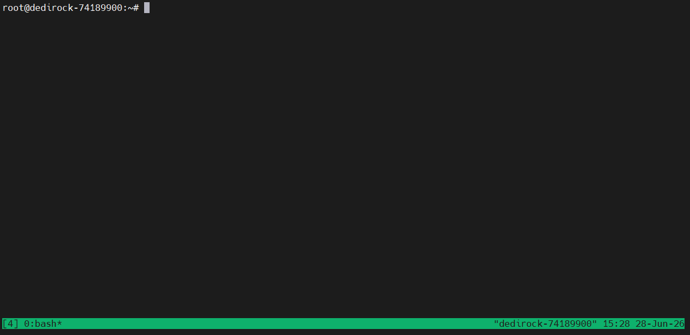

# 一、基本用法
## 1.1 安装
```bash
# Ubuntu/Debian
sudo apt install tmux
```
## 1.2 启动
在终端执行`tmux`会启动tmux窗口，左下方是窗口编号，右下方是系统信息


## 1.3 退出
在tmux窗口输入`exit`退出窗口，也可使用快捷键`Ctrl+d`退出（后台不保留会话）。

>[!TIP]提示
>使用快捷键时，比如分离会话：`Ctrl+b`+`d`,先按下`Ctrl+b`，再按`d`，不是一起按，我第一次用的时候一起按了(错误示范)。
>注意：快捷键严格区分大小写


# 二、常用命令表格
|命令|解释|快捷键|
|---|---|---|
|`tmux ls`|查看所有会话|`Ctrl+b`+`s`|
|`tmux new -s <会话编号/自定义名称>`|创建新会话||
|`tmux detach`|分离会话，会话会在后台运行|`Ctrl+b`+`d`|
|`tmux attach -t <会话编号/自定义名称>`|接入会话||
|`tmux switch -t <会话编号/自定义名称>`|切换会话||
|`tmux kill-session -t <会话编号/自定义名称>`|强制销毁会话||
|`tmux rename-session -t <old-name> <new-name>`|重命名会话|`Ctrl+b`+`$`|
|`tmux split-window`|将窗口划分为上下两个窗格|`Ctrl+b`+`"`|
|`tmux split-window -h`|将窗口划分为左右两个窗格|`Ctrl+b`+`%`|
|`tmux select-pane -U`|将光标移动到上方窗格|`Ctrl+b`+`↑`|
|`tmux select-pane -D`|将光标移动到下方窗格|`Ctrl+b`+`↓`|
|`tmux select-pane -L`|将光标移动到左侧窗格|`Ctrl+b`+`←`|
|`tmux select-pane -R`|将光标移动到右侧窗格|`Ctrl+b`+`→`|
